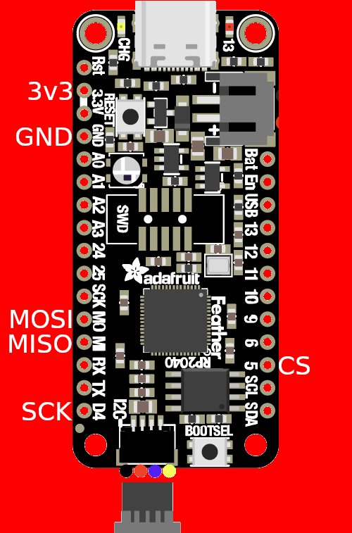

# RP2040 Feather serprog (fork of pico-serprog for use on RP2040 Feather)

Slightly less terrible serprog implementation for the Raspberry Pi Pico and
other RP2040 based boards. Based on
.
Further improved by kukrimate .
Further improved by Riku\_V .
Made work on a RP2040 by me (LordSkeletonMan) here.

For a guide on how to flash a chip see
.

This takes about 17 seconds to read the 8MiB BIOS chip of an X200.

Pinout for the SPI lines:
| Pin | Function |
|-----|----------|
|  7  | CS       |
|  20 | MISO     |
|  19 | MOSI     |
|  6  | SCK      |



## Compiling

```
mkdir build
cd build
cmake ../
make
```

Plug in your RP2040 Feather. Mount it as you would any other USB flash drive.
Copy `pico_serprog.uf2` into it. Your programmer is now ready.
If you want to change the firmware, you need to press the button
on the board while you plug it in.

## Usage

Substitute ttyACMx with the actual tty device corresponding to the firmware.
You can find this by running `dmesg -wH`. When you plug in the device, a line
containing something like this will appear:

```
[453876.669019] cdc_acm 2-1.2:1.0: ttyACM0: USB ACM device
```


Read chip:

```
flashprog -p serprog:dev=/dev/ttyACMx,spispeed=32M -r flash.bin
```

Write chip:
```
flashprog -p serprog:dev=/dev/ttyACMx,spispeed=32M -w flash.bin
```

Multiple chips can be connected at the same time. Pins GP5-GP8 are Chip
Selects 0-3, respectively. The firmware defaults to using Chip Select 0.
```
flashprog -p serprog:dev=/dev/ttyACMx,cs=0 -r chip0.bin
flashprog -p serprog:dev=/dev/ttyACMx,cs=1 -r chip1.bin
```

## License

As a lot of the code itself was heavily inspired/influenced by `stm32-vserprog`
this code is licensed under GPLv3.

pinout.png is based on
[Adafruit Feather RP2040 pinout.pdf](https://github.com/adafruit/Adafruit-Feather-RP2040-PCB/blob/main/Adafruit%20Feather%20RP2040%20pinout.pdf)
by Adafruit Industries, under the
[Creative Commons Attribution-ShareAlike license](https://creativecommons.org/licenses/by-sa/4.0/)
license.
